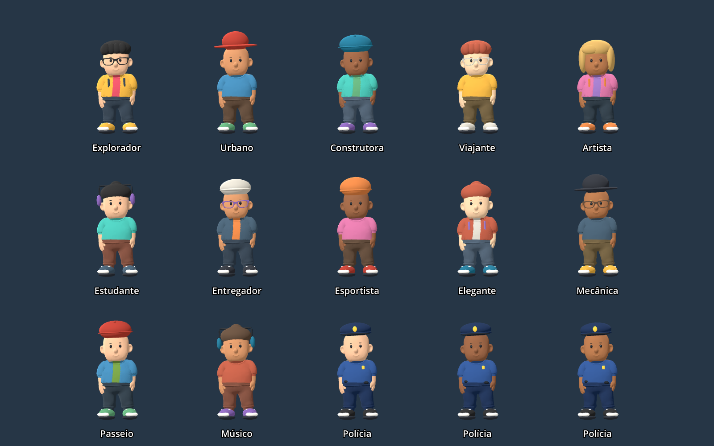

> Próxima evolução planejada em 21/09/2026: [bairro, perseguição e visual](URBAN_GAMEPLAY_PLAN.md). O texto abaixo documenta entregas anteriores; a proposta nova ainda não está implementada.

# Personagens modulares — 19/09/2026

## Entrega

Uma base chibi compartilhada por jogador, civis, ladrões e policiais, derivada de
`Personagens/movimentos/Chibi_running.blend`. Não foram usados créditos Meshy.
`hero.glb`, `hero2.glb` e os arquivos de origem foram preservados.

- `assets/models/characters/modular/citizen.glb`: esqueleto Mixamo, clipes
  `idle`, `walk`, `run`, partes e zonas de material; cerca de 2,8 MB.
- 12 combinações iniciais editáveis; todos os civis/ladrões usam o mesmo catálogo.
- Camiseta, calça, pele, sapatos, jaqueta e acessórios com cores independentes.
- Jaqueta opcional; óculos; mochila; cabelo curto, chanel, coque ou sem cabelo.
- Boné, gorro, chapéu, capacete, fones ou nenhum acessório.
- Uniforme policial com boné, distintivo e cinto, reservado à polícia.
- 40 civis + 6 ladrões bots + 3 policiais + jogador: 50 personagens iniciais.
- Menu → **PERSONAGEM E ACESSORIOS**: prévia 3D, animações, seleção, salvar.
  Aparência persistida em `user://appearance.cfg`; prévia policial não a substitui.
- `scenes/character_gallery.tscn`: vitrine de civis e variantes do policial.
- `source/citizen.blend`: fonte editável; `.gdignore` evita importação automática.
  No Outliner, habilitar o acessório desejado; todos usam o mesmo esqueleto.



## Contratos preservados

`CharacterBase.set_outfit` renderiza dados de aparência pelo mesmo caminho em
todos os papéis. F copia todos os campos, a vítima fica sem acessórios, de shorts
e descalça, cai e desaparece; a identidade anterior retorna na próxima troca.
A conversão restaura a vítima e veste o uniforme, preservando o tom de pele.
Cada instância possui seu AnimationPlayer; materiais de cores iguais são
compartilhados sem mutação após criação. Velocidade seleciona parado/andar/correr;
congelamento e fim da partida selecionam idle. O jogador orienta o modelo interno
pela direção de movimento, sem mudar a câmera; NPCs mantêm seu controlador.

`main.gd` mudou somente no total de civis e na passagem da aparência para a
conversão de bots. Regras de roubo, revista, vitória, nervosismo e rede não foram
alteradas. O POC multiplayer continua separado.

## Reconstrução e testes

Na raiz do projeto (PowerShell):

```powershell
& 'C:\Program Files\Blender Foundation\Blender 5.2\blender.exe' -b --python tools/build_characters.py
& 'D:\Programas\Godot\Godot_v4.7-stable_win64.exe' --headless --path . --editor --import --quit
python tools/run_character_checks.py
```

`PERFECT_RUSE_SOURCE_BLEND` pode apontar para outra localização do blend original;
`GODOT_BIN` pode selecionar outro executável. O runner isola APPDATA em
`runtime-profile/` para não alterar a aparência salva do usuário. Os testes de
imagem precisam de GPU; os testes de regras/integração rodam headless.

Validação local, Godot 4.7, RTX 5070:

- 175 verificações de integração: PASS (clipes animam o esqueleto, 12 presets,
  50 personagens, disfarce real, retorno de vítima, conversão de jogador e bot).
- 56 verificações do seletor: PASS (exclusividade de acessórios, cabelo,
  prévia policial, salvar/recarregar e aparência da vítima sem roupa).
- Partida headless por 1200 frames: PASS, sem SCRIPT ERROR.
- Capturas reais do Godot: seletor, policial, galeria idle/walk/run e cidade.
- Smoke gráfico: média de 60 FPS em 180 frames a 1280×800, 40 civis presentes.
  É uma amostra curta desta máquina; não é certificação para hardware fraco.
- Logs e imagens em `docs/characters/`. O sandbox emite o aviso do Windows
  `Failed to read the root certificate store`; não impediu os testes locais.
- Controle interativo via Computer Use indisponível (native pipe ausente).
  Capturas foram produzidas pelo próprio viewport do Godot e inspecionadas.
  Aprovação artística e teste manual pelo autor ainda são necessários.

## Ajustes durante a execução

1. Primeira redução de malha deixou bordas de roupa irregulares e artefatos em
   botas/cabelo. Corrigido cortando limites de material antes da redução,
   separando bordas entre materiais e substituindo botas/cabelo por formas lisas.
   Prevenção: validar close-up e animação, não só importação/arquivo existente.
2. Godot tentou gravar logs no perfil bloqueado e encerrou. Runner passou a usar
   perfil temporário e caminho de log explícito; execução subsequente passou.
3. Teste do seletor inicialmente falhou na inferência de um Dictionary vindo de
   cena dinâmica; tipo explícito corrigido e suíte executada novamente.
4. Revisão externa pelo Claude não realizada: primeira chamada sem rede e
   escalonamento bloqueado pela revisão automática por envio de código privado.
   Aprovação específica solicitada; implementação e validação locais continuaram.

## Limites e próximos trabalhos

Uma silhueta corporal compartilhada, três cabelos e variações cosméticas; não
são 12 corpos esculpidos individualmente. Não há animações novas de mãos/facial
para cada ação: locomoção usa os três clipes existentes, queda usa o fluxo do NPC.
Chapéus ocultam cabelo para evitar interseção; fones permitem cabelo.
Peças usam acabamento simples apropriado à distância da câmera do jogo.

A IA policial ainda consulta dinheiro carregado, além das pistas observáveis;
isso é anterior a esta integração e não foi alterado. Rede e balanceamento da
população ampliada ainda precisam de playtest específico.
